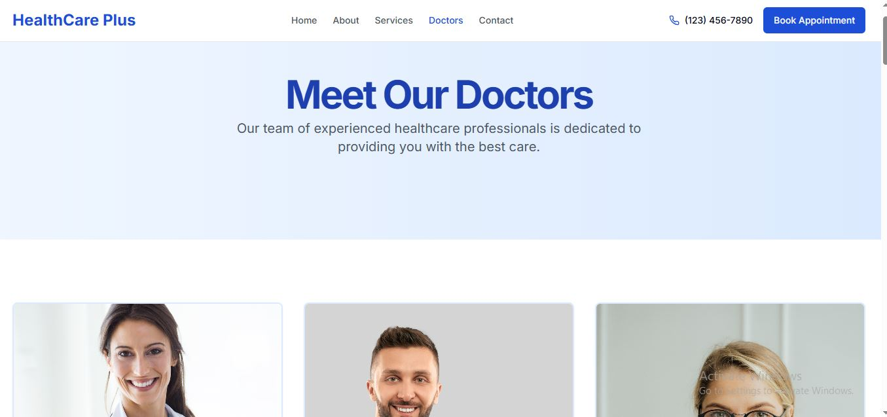

# HealthConnect
<div align="center">
  <h3>Professional Healthcare Services Across Ontario, Canada</h3>
  <p>🩺 Trusted • Accessible • Patient-centered 🩺</p>
</div>

## 📋 Project Overview
This Next.js-based website provides a streamlined platform for HealthConnect's healthcare services, allowing patients to explore available medical services, review practitioner profiles, and book appointments online. The site features a responsive design with intuitive navigation and interactive elements to deliver an exceptional patient experience.

<div align="center">
  
</div>

## ✨ Key Features
- **📱 Responsive Design** - Optimized for all devices from mobile to desktop
- **🔄 Smooth Scrolling Navigation** - Effortless section-to-section navigation throughout the site
- **👨‍⚕️ Services Directory** - Comprehensive display of all healthcare service offerings
- **✓ Detailed Service Information** - Transparent breakdown of what's included in each healthcare service
- **📅 Online Appointment Booking** - Integrated system for scheduling healthcare appointments
- **👩‍⚕️ Practitioner Profiles** - Detailed information about healthcare providers
- **💰 Insurance Information** - Coverage details and accepted insurance providers
- **⭐ Patient Testimonials** - Showcase of patient reviews and feedback
- **🔒 Secure Patient Portal** - Protected access to personal medical information and appointment history

## 📸 Screenshots
<div align="center">
  
  <p><em>About Us</em></p>
  
  
  <p><em>Our Services</em></p>
  
  
  <p><em>Our Doctors</em></p>
  
  
  <p><em>Contact Us</em></p>
  
  
  <p><em>Booking Form</em></p>
</div>

## 🛠️ Technologies Used
<div align="center">

| Technology | Purpose |
|------------|---------|
| Next.js | Frontend framework with SSR |
| React.js | UI components |
| TypeScript | Type-safe programming |
| Tailwind CSS | Styling and responsiveness |
| Prisma | Database ORM |
| MongoDB | Database |
| React Query | Data fetching and caching |
| React Hook Form | Form handling |

</div>

## 🚀 Installation and Setup
1. **Clone the repository:**
   ```bash
   git clone https://github.com/YourUsername/HealthConnect.git
   ```
2. **Navigate to the project directory:**
   ```bash
   cd HealthConnect
   ```
3. **Install dependencies:**
   ```bash
   npm install
   ```
4. **Set up environment variables:**
   ```bash
   cp .env.example .env.local
   ```
   Then edit the `.env.local` file with your configuration details
   
5. **Set up the database:**
   ```bash
   npx prisma migrate dev
   ```

6. **Run the development server:**
   ```bash
   npm run dev
   ```

## 📞 Contact Information
For inquiries about our healthcare services:
- **Phone:** +1 (647) 455-1234
- **Email:** [contact@healthconnect.com](mailto:contact@healthconnect.com)
- **Website:** https://online-health-care-services.vercel.app/

---
<div align="center">
  <p>© 2025 HealthConnect. All Rights Reserved.</p>
</div>
